# CRUD MongoDB Artifact

[click here](https://joeyf12.github.io/) to go back to home page. Use [This Link](MongoCapProgarm_Update.zip) to download the program.

For the Databases artifact, I chose to use the RESTful api program that was created in my CS-340 Client Server Development class. This program was created to allow a user to be able to access a database created in Mongo and be able to carry out basic CRUD commands through python code. I chose this artifact because I believe it shows my knowledge working in the Mongo environment as well as Python code. This artifact shows my ability to combine my knowledge utilizing a Mongo database and the Python language to have them work with each other. This further demonstrates my ability to create a functioning database and code that will be able to be built upon and expanded. Using Python code, I can show how I can gain access to the Mongo Database and execute basic CRUD commands to allow a user to edit their database with ease. When the Artifact was first selected it was in a state where the code was laid out but was not fully functional.

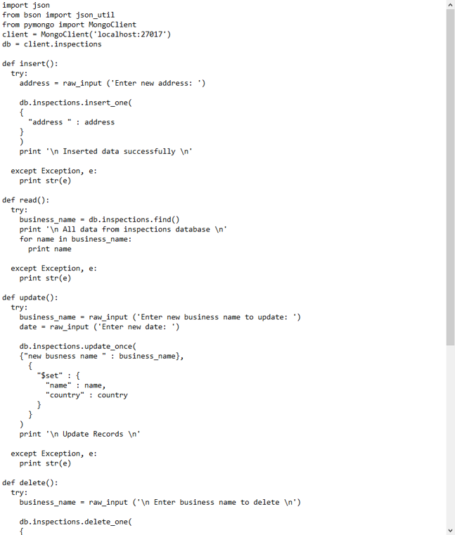
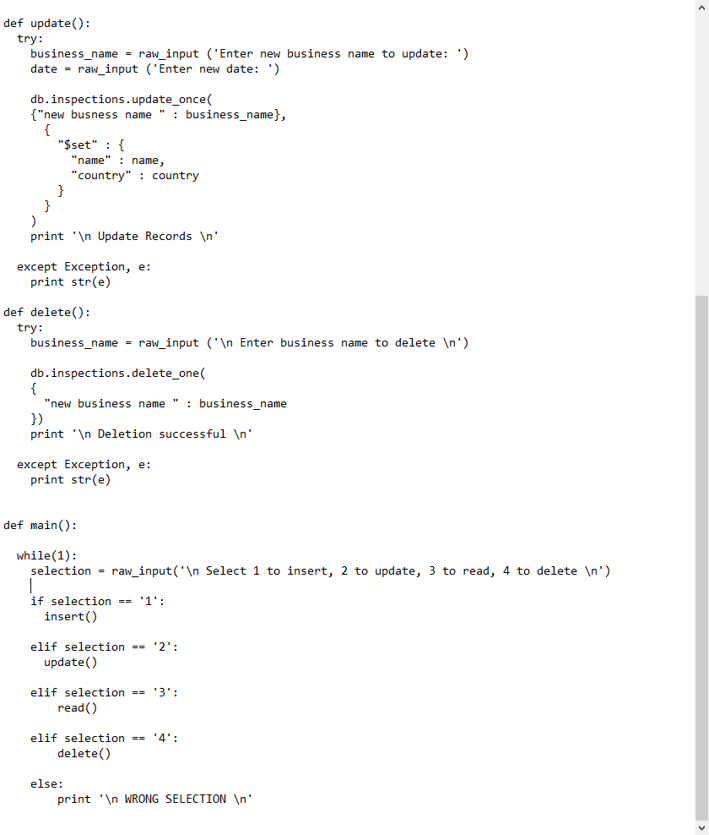

The code was stored in a NotePad file to be transferred to the Pycharm IDE to be worked on for this capstone. During my CS-340 class I ran into an issue where the code was running and the program was exiting but commands entered in the program was not executing, documents would not be updated or deleted as entered by a user. I unfortunately was not able to figure out the cause of this issue during the course and decided to go back to the program as it would help me to build upon what I learned. Another issue with the code was that it was not properly commented which caused some confusion when going back to the code to make changes. For this Enhancement I was able to improve this code by first setting up a new Mongo Database by using the website Mongodb.com.
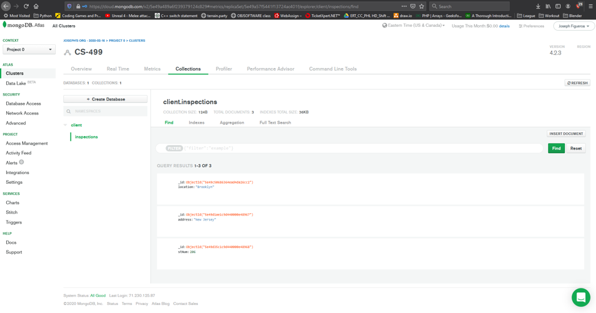

This website allowed me to create a Mongo Database that can be accessed and updated. Once I created the project name CS-499, I then created the database “clients” , entered the collection “inspections” and added 3 documents to the collection. After creating the database I then began working on the pycharm code.
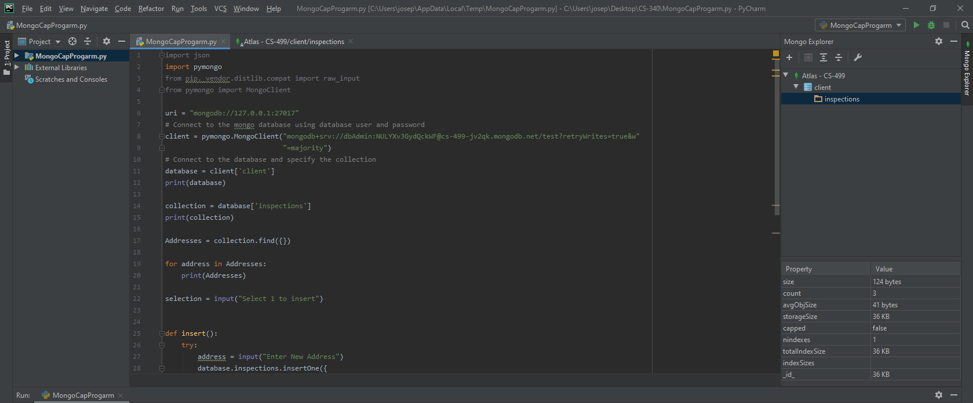
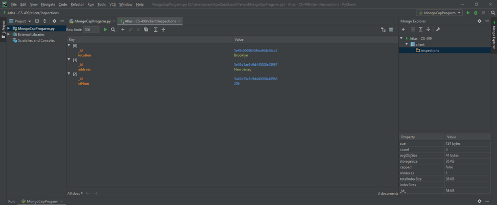

I first began with defining variables that will be utilized for connecting with the database and entering the host and port for the code to be able to access the database. I then installed a Mongo plugin which added a Mongo Explorer to the pycharm IDE that allowed me to see my database and collections in real time. This would allow me to see changes made to my database and speed up testing. I then added a switch like statement that would check a value that is entered by the user with the print statement Python “"Select 1 to insert, select 2 to Delete, or 0 to exit"”.
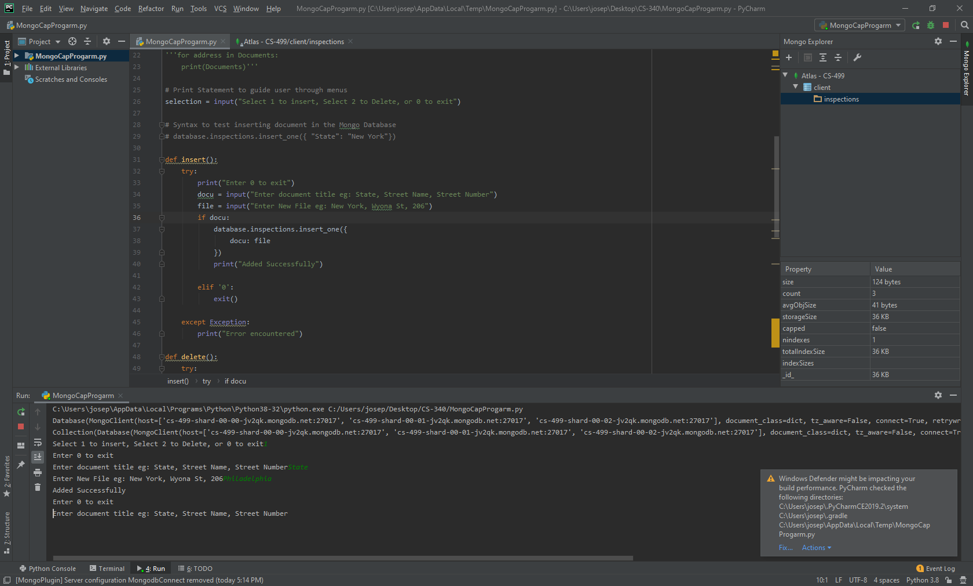
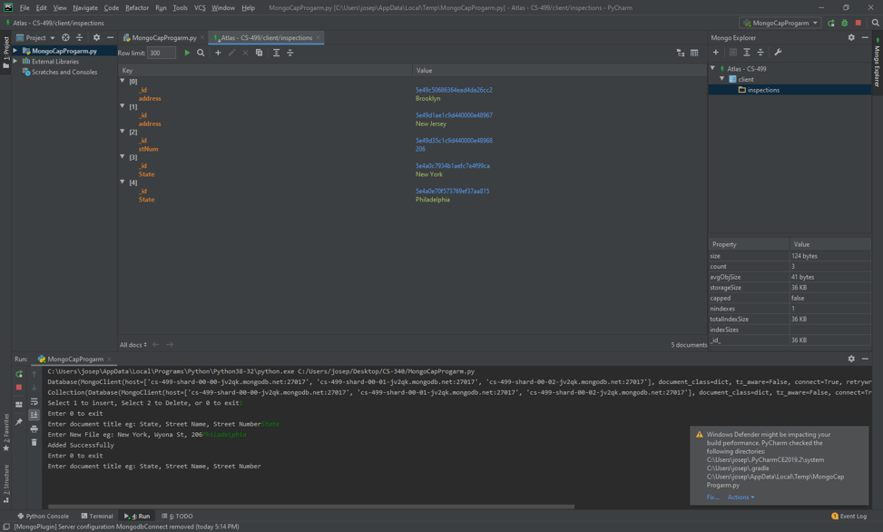

I then added the insert command to the python code which would check for the document type and data being entered. Once entered I tested the function by entering “State” and “Philadelphia”. I confirmed that the code was able to add the state by checking the Mongo Explorer. 
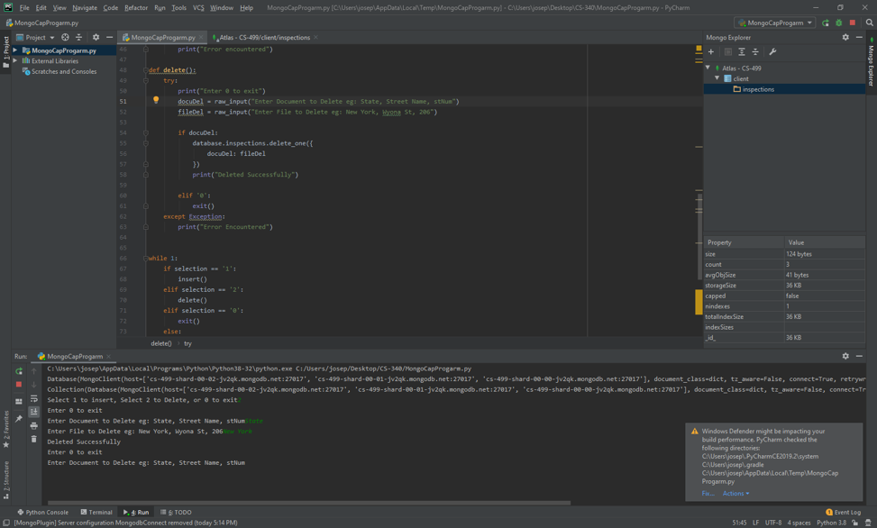
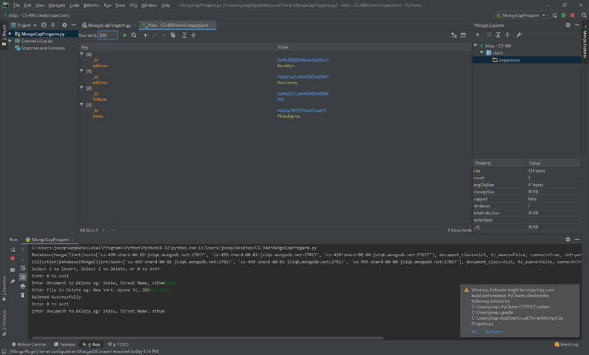

After this I added a delete function to the code which would check the document type and data being entered much like the insert command. I was able to confirm that this was working by entering “State” and “New York” and confirming that the document was able to be deleted. So far, I feel like I am meeting my objectives that was set in Module one. I was able to add the insert and delete commands to the python code and confirm that they were working properly. Next, I will need to enter the Update and Read commands to complete the CRUD commands that this code is supposed to carry out. 

I started off the new enhancements by implementing the Read function in the CRUD program. I began by creating the function read() and adding a try statement and adding a variable docuName with the database command ```python database.inspections.find()``` which allows the program to locate all documents in the database. I then added a for loop that would look for ‘name’ in docuName and then print ‘name’. 
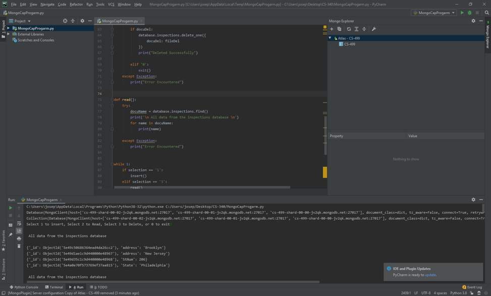
  
This was able to list the current documents listed in the database and update as new documents are added and deleted.
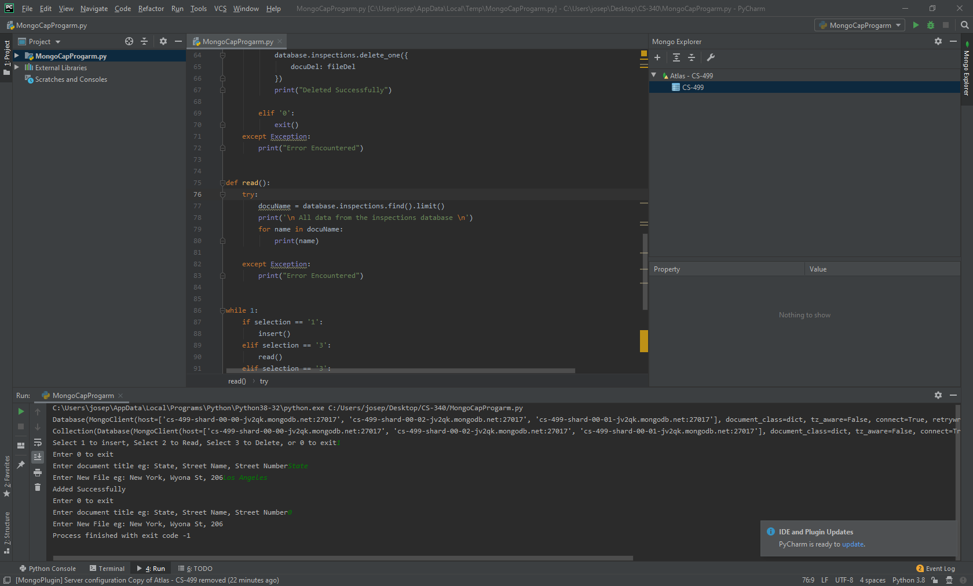
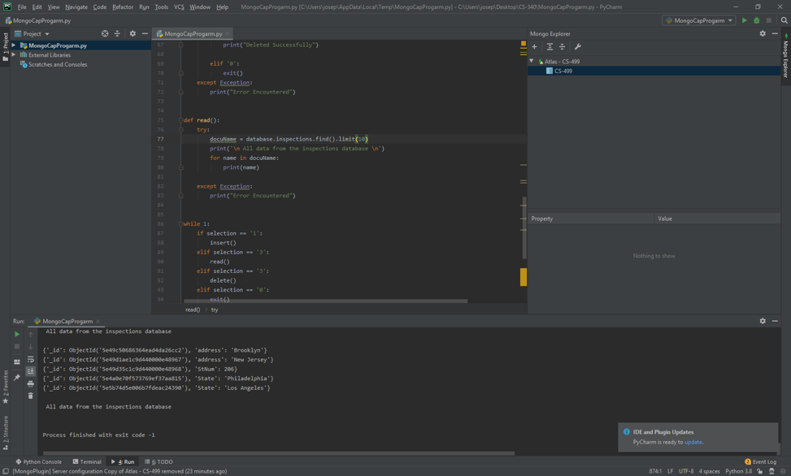

I then added a ```python limit()``` command to the end of ```python database.inspections.find()``` to resolve and issue where the for loop would constantly run, but this did not resolve the issue. I Then attempted to add a ```python .hasNext()``` and ```python .next()``` cursors but this also did not resolve the issue. 
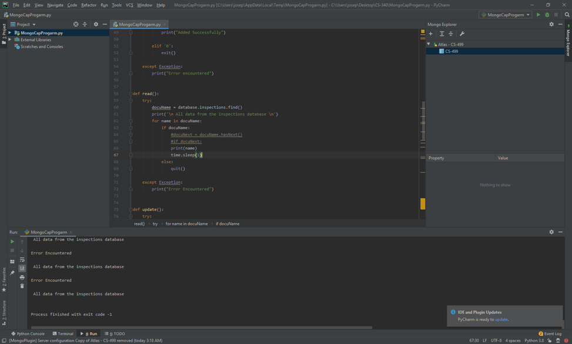

As of right now, progress is being made in the program, but the issue where the for loop is constantly running will need to be resolved before the ‘Update’ function can be added. I plan to continue working on this program to get the errors resolved and completing the CRUD commands.
