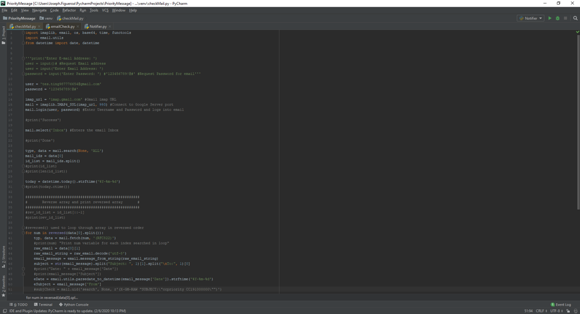
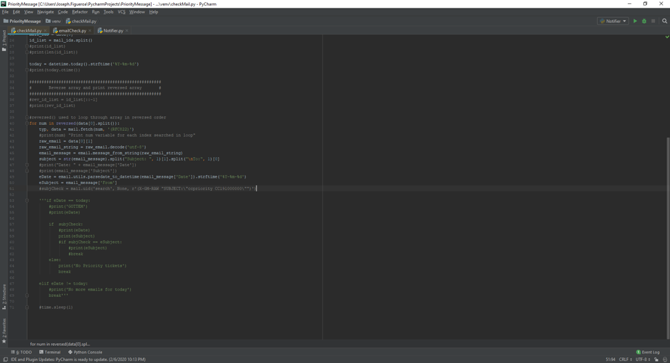
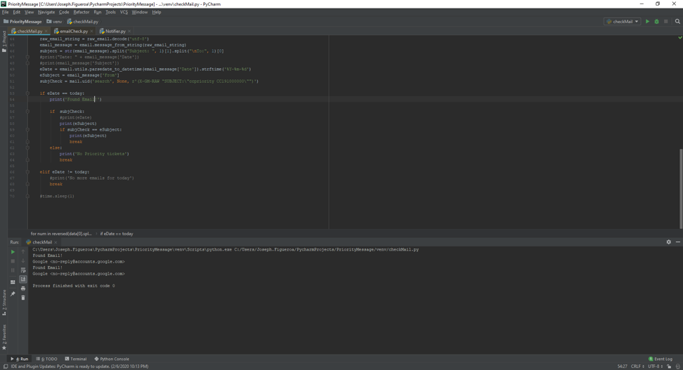
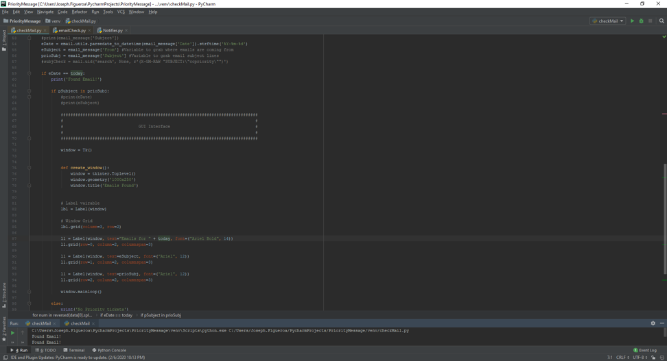
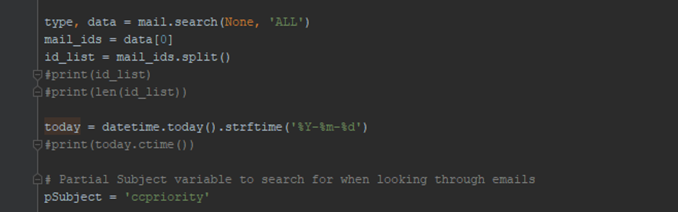
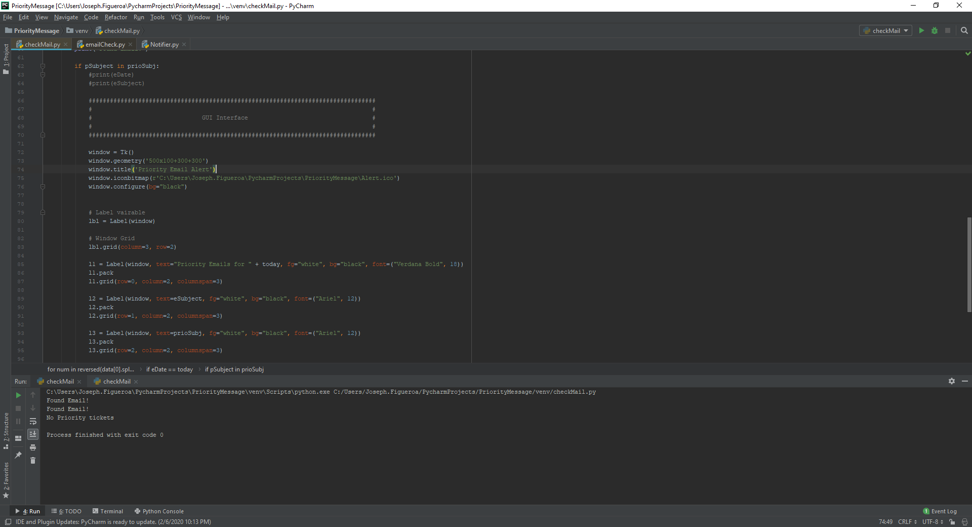
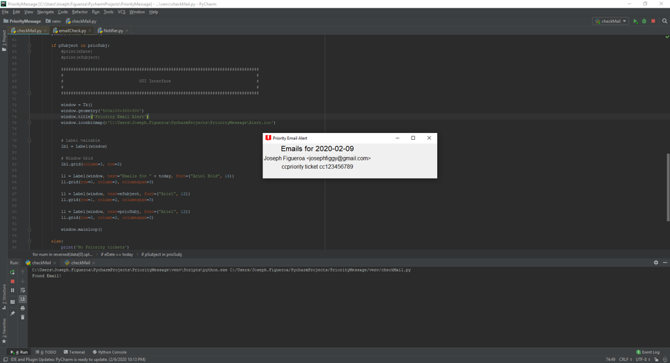
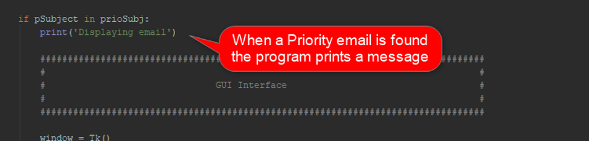
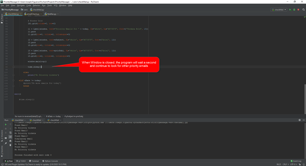

# Email Notification Software Artifact

[click here](https://joeyf12.github.io/) to go back to home page. Use [This Link](EmailNotificationUpdated.zip) to download the program.

For the Algorithms and Data Structure project I chose a program that I am currently working on outside of school which focuses on sending email alerts. I began working on this program for my job because employees would miss emails with Priority tickets until the end of their shifts. Priority tickets are tickets that need to be worked on right away and are sent from management via email. The problem that was being ran into was that employees would not be able to check their email regularly due to work volume and it would be too late by the time they checked their email. This program is made to help alleviate the need to employees to check their emails frequently for priority ticket. This program will read through a user’s email inbox and look for subject lines that match the search criteria e.g. “Priority”. Once the program finds a email with the subject line that matches the criteria it will pop up an alert that informs the user of the priority ticket received. 

I chose to add this artifact in my ePortfolio because I feel like it shows my ability to create a program using data structures and algorithms to solve a problem. I believe that this program gives a look into algorithms/data structures that I can implement and displays my use of syntax in a larger program. Ultimately, I plan for this program to utilize different classes to fulfill the remaining tasks that is needed, and I think that this will also be helpful in displaying my versatility in the Python coding language. This artifact was improved by adding a more refined search criteria and adding the pop-up window to alert the user of the priority email received. So far, I believe that I am meeting my course objectives that I planned out in Module One. With the implementation of the pop-up window and refined search criteria I can say that this program is closer to being ready for field tests.

When the program was added to this project it was set to access the users email address and read through the emails listed (For the program a test email ‘tes.ting987776654@gmail.com was used).

In this state, the program was able to access the email address and pull the latest emails received. This was not the outcome wanted since it does not search for a key word in the subject line. From this point I then focused on adding the pop-up window that would appear when the program finds an email. I did this by adding the tkinter library and adding the variables that stored the email information.

From here I then added a variable pSubject which stored the keyword that would act as the partial subject that the program will search for.

I was able to confirm that the program was able to pull only emails that contain the partial subject variable and display it in the pop-up window. I then added a custom icon and changed the background color for the pop-up window.

After implementing these changes, I then added a print statement that informs that an email will be displayed once an email with matching subject line is located. This message is only seen when the program is running in the IDE. I then added a timer that waits until the user exits the pop up window to continue reading through the email. 

