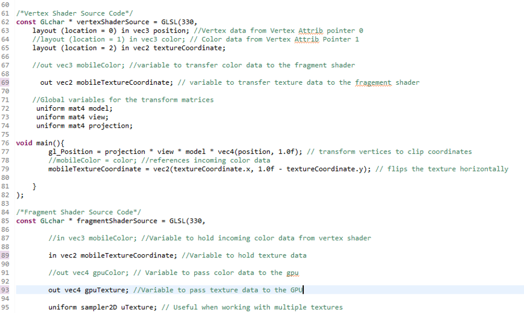

# Wolf Head OpenGL Artifact

[click here](https://joeyf12.github.io/) to go back to home page. Use [This Link]() to download the project files.

For the Software Design and Engineering artifact I decided to use the OpenGL wolf head project that I had to complete for my CS-330 Computer Graphic and Visualization class. For this project I was tasked with creating and texturing a basic model of the wolf’s head shape. Along with this I was tasked with adding navigation around the object and lighting to the project. I chose this project because it shows my ability to manipulate 3D objects utilizing C++ code. I also believe that this project shows my ability to create a visual concept using grid-based layouts. Along with this, this project shows my ability to design a complex program that has multiple moving parts in order to create a function program. The algorithms behind the camera movement and layout of the 3D shapes also show my ability to use math skills gained throughout the Computer Science program to complete a functioning program that can be controlled in a 3D environment. When this artifact was first selected, I was able to map out the basic outline of the wolf head and add a basic navigation syntax that allowed a user to rotate around the object by pressing the ‘Z’ key and moving the mouse.


Along with this, users are also able to press the ‘W’, ‘A’, ‘S’, and ‘D’ keys to move the camera around the 3D environment. For enhancements that would be made I decided to add elements to the wolf head that I was not able to add during the course. This being cleaner navigation, texture and lighting. I knew that I would be able to add upon the foundation I already laid and using previous works that I completed throughout the course to complete these enhancements. I began with adding ‘texture’ to the variable declarations for the program and adding ```UGenerateTexture(void)``` to the function prototypes. 


I then was able to add variables for texture data being transferred to the fragment shader, and GPU, as well as hold incoming texture data.


Once done, I was able to add the UGenerateTexture function to the main program and activate the texture by adding glBindTexture(GL_TEXTURE_2D, texture); in the void URenderGraphics(void) function to render graphics. From here, I changed the color coordinates of the wolf head shape and changed them to texture coordinates lowering them from 3 vertices to 2.


I then added the UGenerateTexture function with the texture that would be loaded and set the attribute pointer 2 to hold texture coordinate data. However, ran into issues with the shape when entering data into the pointer and entering the incorrect coordinates for the texture.


I was able to resolve this issue by correcting the texture coordinates and fixing the attribute pointer.


Once fixed, I then added the Wolf head image that I had from the course but ran into issues with the size and layout of the texture due to the shape being made of triangles.


Due to this I decided to add a fur texture to the shape to give it a more natural look.


Once this was completed, I then moved on to tighten the camera rotation around the shape. Originally the camera would be able to be rotated, but the camera would not remain stationary and orbit around the object. This was a simpler enhancement to implement as I needed to comment out the syntax lines:
	    
      ```c++
      //front.x = cos(glm::radians(pitch)) * cos(glm::radians(yaw));
	    //front.y = sin(glm::radians(pitch));
	    //front.z = cos(glm::radians(pitch)) * sin(glm::radians(yaw));
      ```
      


Once these lines were removed the object was able to remain in the center of the camera after a user holds down the ‘Z’ key and moves the mouse around the program window. This allowed for easier navigation around the object for future enhancements. There is still lighting that needs to be added to this project, but now I am pleased with the progress of my enhancements. I feel like I am meeting my objectives that I set when I listed my goals.
